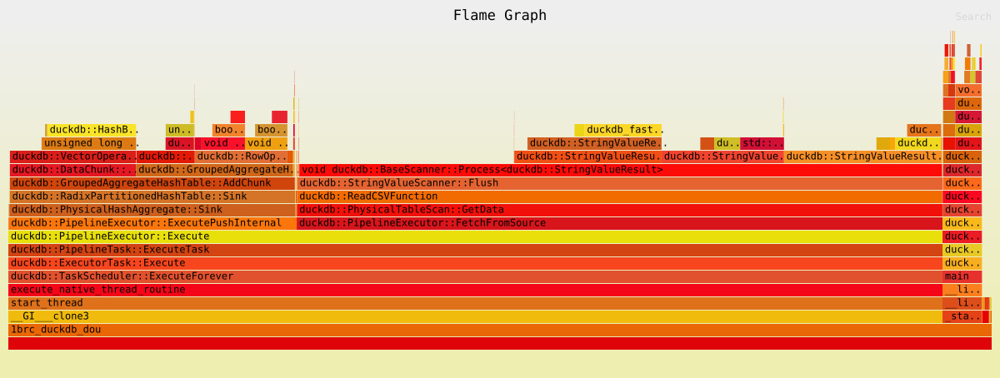

# One Billion Row Challenge Implementations



This repository contains high-performance implementations of the [One Billion Row Challenge](https://github.com/gunnarmorling/1brc) using different technologies and optimization strategies.

## 🏆 Performance Results

Both implementations achieve exceptional sub-10-second performance on the full 1-billion-row dataset. The table below summarizes the benchmark results for both `Decimal` and `Double` schema types.

| Implementation         | Schema  | Mean Time (s) | Std Dev (s) | Min Time (s) | Max Time (s) | Binary Size |
| ---------------------- | ------- | ------------- | ----------- | ------------ | ------------ | ----------- |
| **1brc-datafusion-rs** | Decimal | 5.56          | 0.05        | 5.49         | 5.67         | 37M         |
| **1brc-datafusion-rs** | Double  | 5.68          | 0.11        | 5.47         | 5.83         | 37M         |
| **1brc-duckdb-cpp**    | Decimal | 8.53          | 0.08        | 8.45         | 8.71         | 29K         |
| **1brc-duckdb-cpp**    | Double  | 8.83          | 0.06        | 8.70         | 8.92         | 29K         |

*Benchmarks performed on AMD Ryzen 9 5900X (24 cores) @ 4.95 GHz, 32GB RAM*

## Implementations

### [1brc-datafusion-rs](./1brc-datafusion-rs/) - Rust Implementation
- **Technology**: Apache DataFusion query engine
- **Strategy**: Systematic optimization with explicit schema, compiler tuning, and Profile-Guided Optimization
- **Key Features**: High-level API constraint, production-ready safety

### [1brc-duckdb-cpp](./1brc-duckdb-cpp/) - C++ Implementation  
- **Technology**: DuckDB analytical database
- **Strategy**: Single SQL query with aggressive compiler optimizations
- **Key Features**: Minimal code complexity, maximum CPU utilization

## Generating Test Data

The official 1BRC data generator is included in this repository. Use it to create the measurements dataset:

```bash
# Compile the data generator (requires Java and javac)
javac dev/morling/onebrc/CreateMeasurements.java

# Generate the full 1 billion row dataset (takes 5-10 minutes)
time java -cp . dev.morling.onebrc.CreateMeasurements 1000000000

# Or generate a smaller test dataset for development
java -cp . dev.morling.onebrc.CreateMeasurements 100000
```

The generator creates realistic weather station data with:
- 413 authentic weather stations from around the world
- Gaussian-distributed temperatures around each station's mean
- Temperature range: -99.9°C to +99.9°C
- Output file: `measurements.txt` (approximately 12-16 GB for 1 billion rows)

## Quick Start

### Prerequisites
- **Java**: For data generation
- **C++**: GCC/Clang with CMake for C++ implementation
- **Rust**: Latest stable version for Rust implementation
- **hyperfine**: `cargo install hyperfine` (recommended for benchmarking)

### Build and Run
```bash
# 1. Generate test data
javac dev/morling/onebrc/CreateMeasurements.java
java -cp . dev.morling.onebrc.CreateMeasurements 1000000000

# 2a. Run Rust implementation (fastest)
cd 1brc-datafusion-rs
./build_updated.sh
./benchmark.sh                                              # Comprehensive benchmark
# OR manually:
time ./target/release/onebrc-datafusion-double ../test_data/measurements_1b.txt results_double.csv

# 2b. Run C++ implementation
cd ../1brc-duckdb-cpp
./build_updated.sh
./benchmark.sh                                              # Comprehensive benchmark  
# OR manually:
time ./build/1brc_duckdb_double ../test_data/measurements_1b.txt results_double.csv
```

## Architecture Strategy

Both implementations use a **query engine approach** rather than custom data processing:

- **Core Philosophy**: Leverage purpose-built analytical engines instead of implementing custom parsing/aggregation
- **Single Query Strategy**: Delegate entire data pipeline (reading, parsing, grouping, sorting) to declarative SQL
- **Engine Optimization**: Configure database engines for maximum CPU/memory utilization
- **Minimal Host Code**: Focus only on configuration and result formatting

This approach avoids the complexity of building custom high-performance parsers, instead relying on heavily optimized, parallel, and vectorized analytical database engines.

## Implementation Standardization

Both implementations follow key standardizations for consistency:

- **No A Priori Station List**: Implementations dynamically discover weather stations from the data rather than using a predefined list of 413 stations
- **CSV Output Format**: All implementations output results as CSV files instead of the original challenge's print format, enabling better data processing and analysis

### Output Format
Both implementations process input format `<station_name>;<temperature>` and produce a CSV file:
```csv
station_name,min_measurement,mean_measurement,max_measurement
Bulawayo,8.9,9.0,9.1
Hamburg,12.0,12.6,13.2
Palembang,38.8,38.9,39.0
```
Results are sorted alphabetically by station name with temperatures rounded to one decimal place.

## Repository Structure

```
1brc/
├── dev/morling/onebrc/          # Java data generator (shared)
├── measurements.txt             # Generated dataset (shared)
├── test_data/                   # Test datasets
│   ├── measurements_1k.txt     # 1,000 row test dataset
│   └── measurements_1b.txt     # 1 billion row dataset
├── 1brc-duckdb-cpp/            # C++ implementation using DuckDB
│   ├── README.md               # Detailed C++ implementation guide
│   ├── CLAUDE.md               # Claude Code guidance
│   ├── src/main_double.cpp     # Double-precision implementation
│   ├── src/main_decimal.cpp    # Decimal-precision implementation
│   ├── test.sh                 # Test script (uses measurements_1k.txt)
│   ├── benchmark.sh            # Comprehensive benchmark script
│   └── build/                  # Compiled binaries
├── 1brc-datafusion-rs/         # Rust implementation using DataFusion  
│   ├── README.md               # Detailed Rust implementation guide
│   ├── CLAUDE.md               # Claude Code guidance
│   ├── src/main_double.rs      # Float64 implementation
│   ├── src/main_decimal.rs     # Decimal128 implementation
│   ├── test.sh                 # Test script (uses measurements_1k.txt)
│   ├── benchmark.sh            # Comprehensive benchmark script
│   └── target/release/         # Compiled binaries
└── README.md                   # This overview file
```

### Key Insights
- **DataFusion (Rust)**: Achieves highly consistent performance through systematic optimization
- **DuckDB (C++)**: Achieves excellent parallelization
- Both approaches prioritize **declarative simplicity** over custom implementation complexity

## References

- [One Billion Row Challenge](https://github.com/gunnarmorling/1brc) by Gunnar Morling
- [Apache DataFusion](https://github.com/apache/arrow-datafusion) - Rust query engine
- [DuckDB](https://duckdb.org/) - Analytical database for C++
